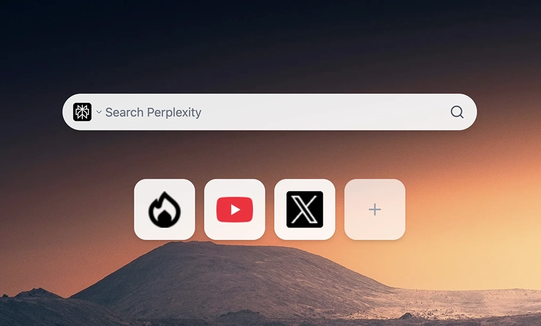

# Home Page



A minimal Chrome extension that replaces your new tab page with a clean, customizable home page featuring multi-engine search and bookmarks.

## Features

- Custom new tab page with background image
- Multi-engine search (Google, Bing, DuckDuckGo, etc.)
- Bookmark management
- Minimal and fast

## Tech Stack

- [Bun](https://bun.sh) - Runtime and bundler
- [React](https://react.dev/) - UI framework
- [TailwindCSS](https://tailwindcss.com/) - Styling
- [BiomeJS](https://biomejs.dev/) - Linting and formatting
- Manifest V3

## Development

Install dependencies:

```bash
bun install
```

Run in development mode:

```bash
bun run dev
```

Build for production:

```bash
bun run build
```

Package for publishing:

```bash
bun run pack
```

## Installation

1. Run `bun run build`
2. Open Chrome and navigate to `chrome://extensions`
3. Enable "Developer mode"
4. Click "Load unpacked" and select the `build` folder

## License

MIT
